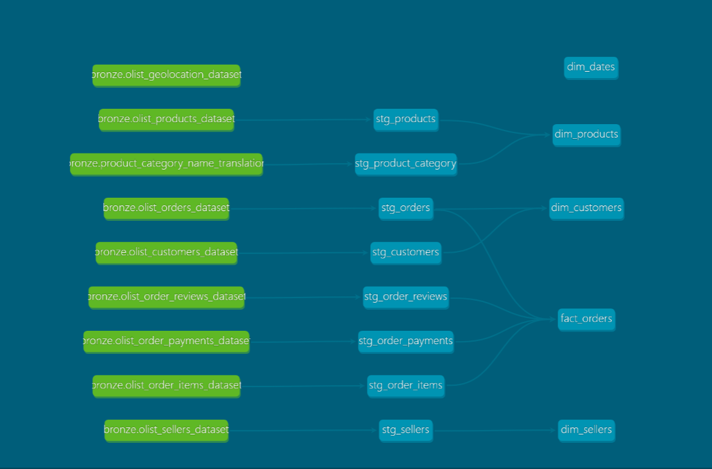

# 🛒 E-Commerce Analytics Engineering Project

An end-to-end Analytics Engineering project built with **dbt + Snowflake** on the 
Brazilian E-Commerce dataset (Olist) — 100k+ real orders across 9 source tables.

## 🎯 Problem Statement

A mid-size e-commerce company has raw transactional data scattered across multiple 
source systems. Business teams can't answer critical questions like:
- Which customers are at risk of churning?
- What is our monthly revenue trend?
- Which products drive 80% of sales?

This project builds a clean, tested, and documented data model that analysts can 
trust and query directly — without touching raw data.

---

## 🏗️ Architecture


Raw CSV Sources (9 tables)
↓
Bronze Layer  →  Raw data loaded into Snowflake as-is
↓
Silver Layer  →  Cleaned, typed, deduplicated (dbt views)
↓
Gold Layer    →  Star schema: fact + dimensions (dbt tables)
↓
dbt Tests + Docs + Lineage


---

## 📊 Data Lineage



---

## 🗂️ Data Models

### Silver Layer (Staging)
| Model | Description |
|---|---|
| `stg_orders` | Cleaned orders with typed timestamps |
| `stg_customers` | Customer master with city/state |
| `stg_order_items` | Line items with price and freight |
| `stg_order_payments` | Payment type and value per order |
| `stg_order_reviews` | Review scores and comments |
| `stg_products` | Product dimensions and category |
| `stg_sellers` | Seller location data |
| `stg_product_category` | Portuguese to English category translation |

### Gold Layer (Marts)
| Model | Description |
|---|---|
| `fact_orders` | Central fact table joining orders, items, payments, reviews |
| `dim_customers` | Customer dimension with segmentation (new/returning/loyal) |
| `dim_products` | Product dimension with English category names |
| `dim_sellers` | Seller dimension with location |
| `dim_dates` | Date dimension with year, month, quarter, weekend flag |

---

## ✅ Data Quality

- **26 dbt tests** across all models
- Tests include: `unique`, `not_null`, `accepted_values`, `relationships`
- Review scores validated to accepted range [1–5]
- All primary keys tested for uniqueness and nullability

---

## 🔧 Tech Stack

| Tool | Purpose |
|---|---|
| Snowflake | Cloud data warehouse |
| dbt Core | Data transformation and modeling |
| Python + Pandas | Bronze layer ingestion |
| dbt-codegen | Auto-generating source YAMLs |
| GitHub | Version control |

---

## 📁 Project Structure
```
ecommerce_dbt/
├── models/
│   ├── staging/          # Silver layer - cleaning & typing
│   │   ├── sources.yml
│   │   ├── staging.yml
│   │   └── stg_.sql
│   └── marts/            # Gold layer - star schema
│       ├── marts.yml
│       ├── fact_orders.sql
│       └── dim_.sql
├── macros/
│   └── generate_schema_name.sql
├── packages.yml
└── dbt_project.yml
```


---

## 🚀 How to Run

```bash
# Install dependencies
pip install dbt-snowflake

# Install dbt packages
dbt deps

# Run all models
dbt run

# Run tests
dbt test

# Generate and serve docs
dbt docs generate
dbt docs serve
```

---

## 📬 Contact

**Azhagan** — [LinkedIn](https://www.linkedin.com/in/azhagan) | 
[azhagansubbaraj@gmail.com](mailto:azhagansubbaraj@gmail.com)